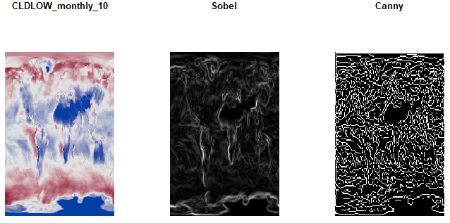
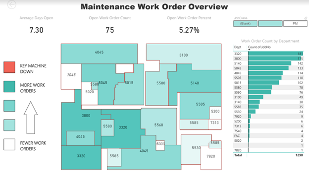

# andyreetz.github.io
Andy's Data Science Portfolio

# [Project: Predicting Image Compressability](https://github.com/andyreetz/Predicting-Image-Compressability)
Project to predict image compressibility of climate data from CESM-LE using classification methods in R

## Introduction
We work to predict the compressibility of images generated by the National Center for Atmospheric Research’s (NCAR) Community Earth System Model - Large Ensemble (CESM-LE). This model produces spatial data for hundreds of climate variables that may be of interest to climate scientists. Due to the expense of storing this massive amount of data, it is desirable to compress the data without degrading the results of the scientific analysis for which the data is used. With a brute-force approach, optimal compression levels were obtained for the training and validation observations, but this method is not feasible for the massive amount of data generated by CESM-LE. Therefore, our objective is to engineer features that can can use to train and develop a high-performing classification model to predict the optimal compression level of these climate images.

### Task 1 Overview - Feature Construction
In order to predict the optimal compression levels, we must first construct and engineer features from the raw CESM-LE data. Because the data could represent almost any climate variable we need to develop features from the raw data instead of the provided variables in the training and validation observations. We work to build a feature space of both simple and complex predictors computed from both global and local statistics that can be used to train a high-performing predictive model.

### Task 2 Overview - Model Development
To create a model capable of accurate predictions we examine several methods. Because many of the engineered
features initially are highly non-normal we either normalize them, or use methods that do not assume feature
normality.

# [Project: Visualize Maintenance Work Orders](https://github.com/andyreetz/Visualize-Maintenance-Work-Orders)
Project to visualize maintenance work orders and drill through to find detailed machine information.

## Problem
A lack of useful metrics for maintenance work orders meant it was impossible to see trends or get a perspective of the bigger picture. There was also no way to see a live view of where critical machinery was down.

## Solution
Using Microsoft’s Power BI, created a data source to the maintenance work order server and a live report. The report was published via the Power BI app so that users would have up-to-date information. Work order volume was color coded onto a map of the facility, with the ability to drill through to more detailed information about time series trends, department details, and recurring issues by machine.
